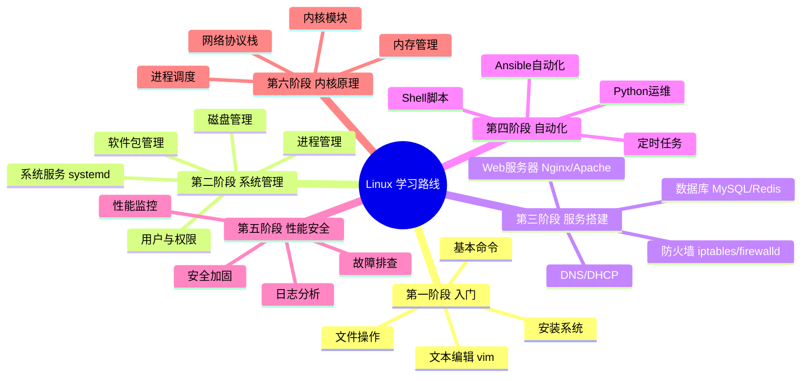

# Linux 学习路线与知识点详解

> 从零基础到运维/开发高手的完整学习路线，覆盖 Linux 核心知识点体系。
> 更新日期：2026年5月

---

## 一、Linux 学习路线图

```
学习阶段                  时间估计      目标岗位
────────────────────────────────────────────────
第一阶段: 入门基础         1-2周        能基本操作
第二阶段: 系统管理         2-4周        运维助理
第三阶段: 服务搭建         3-6周        Linux 运维工程师
第四阶段: Shell 自动化     4-8周        高级运维 / DevOps
第五阶段: 性能与安全       持续         SRE / 架构师
第六阶段: 内核与原理       持续         内核开发 / 资深架构师
```



---

## 二、Linux 核心知识体系

### 2.1 Linux 发行版家族

```
Linux 内核
    │
    ├── Debian 系 ─── Debian ─── Ubuntu ─── Mint / Kali
    │   包管理: apt / dpkg
    │
    ├── Red Hat 系 ─── RHEL ─── CentOS Stream / Fedora / Rocky Linux
    │   包管理: dnf / yum / rpm
    │   企业市场占有率最高
    │
    ├── SUSE 系 ─── openSUSE / SLES
    │   包管理: zypper
    │
    ├── Arch 系 ─── Arch Linux / Manjaro
    │   包管理: pacman
    │   滚动更新，适合喜欢最新的用户
    │
    └── 嵌入式 ─── OpenWrt / Buildroot / Yocto
        路由器、IoT 设备

选择建议:
  入门学习: Ubuntu / Debian (社区大，教程多)
  企业工作: RHEL / Rocky Linux (考 RHCE 认证)
  个人折腾: Arch Linux (深入理解系统)
```

### 2.2 文件系统层次结构 (FHS)

```
/  (根目录)
├── /bin -> /usr/bin        基本命令 (ls, cp, cat...)
├── /sbin -> /usr/sbin      系统管理命令 (fdisk, iptables...)
├── /boot                   内核文件和引导加载程序
├── /dev                    设备文件 (sda, tty, null...)
├── /etc                    系统配置文件
│   ├── /passwd             用户账户信息
│   ├── /shadow             密码哈希
│   ├── /fstab              文件系统挂载表
│   ├── /hostname           主机名
│   ├── /hosts              静态主机名解析
│   ├── /resolv.conf        DNS 配置
│   ├── /ssh/               SSH 配置
│   ├── /systemd/           systemd 配置
│   └── /nginx/             Nginx 配置
├── /home                   普通用户家目录
│   ├── /user1
│   └── /user2
├── /root                   root 用户家目录 (特殊)
├── /lib -> /usr/lib        共享库和内核模块
├── /media                  可移动设备挂载点 (U盘)
├── /mnt                    临时挂载点
├── /opt                    第三方软件安装目录
├── /proc                   进程和内核信息 (伪文件系统)
│   ├── /cpuinfo            CPU 信息
│   ├── /meminfo            内存信息
│   └── /[PID]/             进程信息目录
├── /run                    运行时数据 (tmpfs，重启清空)
├── /srv                    服务数据目录
├── /sys                    内核和设备信息 (伪文件系统)
├── /tmp                    临时文件 (重启可能清空)
├── /usr                    用户程序和文件 (Unix System Resources)
│   ├── /bin                用户命令
│   ├── /sbin               系统管理命令
│   ├── /lib                库文件
│   ├── /local              本地编译安装的软件
│   ├── /share              架构无关的共享数据
│   └── /src                源代码 (可选)
└── /var                    可变数据 (Variable)
    ├── /log                日志文件
    │   ├── /syslog         系统日志
    │   ├── /auth.log       认证日志
    │   ├── /kern.log       内核日志
    │   └── /nginx/         Nginx 日志
    ├── /spool              队列 (邮件/打印)
    ├── /lib                程序运行时可变数据
    └── /cache              应用程序缓存
```

---

## 三、各阶段详细知识点

### 第一阶段：入门基础（1~2 周）

#### 3.1.1 必知必会命令

```bash
# === 目录操作 ===
pwd                   # 当前目录
cd /path              # 切换目录 (cd - 回上一目录, cd ~ 回家)
ls -la                # 详细列出 (含隐藏文件)
mkdir -p a/b/c        # 递归创建目录
rmdir                 # 删除空目录

# === 文件操作 ===
touch file.txt        # 创建空文件 / 更新时间戳
cp src dst            # 复制 (cp -r 递归)
mv old new            # 移动 / 重命名
rm -rf dir/           # 强制递归删除 (危险!)
ln -s target link     # 创建软链接 (符号链接)
ln target link        # 创建硬链接

# === 文件查看 ===
cat file              # 查看全部内容
less file             # 分页查看 (j/k翻页, /搜索, q退出)
head -n 20 file       # 查看前20行
tail -f log           # 实时跟踪日志末尾 (-f = follow)
wc -l file            # 统计行数 (-w单词, -c字节)

# === 文件搜索 ===
find / -name "*.log"  # 按文件名查找
find . -size +100M    # 按大小查找
find . -mtime -7      # 按修改时间 (7天内)
grep "pattern" file   # 搜索文件内容
grep -r "TODO" src/   # 递归搜索目录
which ls              # 查找命令的位置

# === 权限与所有者 ===
chmod 755 script.sh   # 修改权限 (rwx: 读4 写2 执行1)
chmod +x script.sh    # 添加执行权限
chown user:group file # 修改所有者:组
ls -l                 # 查看权限 (如 -rwxr-xr--)

# === 系统信息 ===
uname -a              # 系统/内核信息
df -h                 # 磁盘使用情况
free -h               # 内存使用情况
top / htop            # 实时进程监控
uptime                # 运行时间 + 负载
who                   # 当前登录用户
date                  # 日期时间
cal                   # 日历
```

#### 3.1.2 Vim 编辑器

```
Vim 三种模式:

┌──────────┐    按 i/a/o      ┌──────────┐    按 Esc      ┌──────────┐
│  普通模式 │ ─────────────>  │  插入模式  │ <─────────── │  命令模式  │
│ Navigate │ <─────────────  │   Edit   │               │  Command  │
└──────────┘    按 Esc       └──────────┘               └──────────┘
       │                                                      ▲
       │                   按 : 进入                           │
       └──────────────────────────────────────────────────────┘

常用命令:
  移动: h j k l (左 下 上 右)  w(下一词)  b(上一词)  gg(文件头)  G(文件尾)
  编辑: i(光标前插入) a(光标后) o(下一行) dd(删行) yy(复制行) p(粘贴)
        u(撤销) Ctrl+r(重做) /pattern(搜索) n(下一匹配)
  保存退出: :w(保存) :q(退出) :wq(保存退出) :q!(强制退出)
```

#### 3.1.3 管道与重定向

```bash
# 标准输入输出
stdin  (0) - 标准输入  (键盘)
stdout (1) - 标准输出  (屏幕)
stderr (2) - 标准错误  (屏幕)

# 重定向
cmd > file         # stdout 覆盖写入
cmd >> file        # stdout 追加写入
cmd 2> file        # stderr 写入文件
cmd &> file        # stdout + stderr 都写入
cmd < file         # 从文件读取输入

# 管道
cmd1 | cmd2        # cmd1的stdout -> cmd2的stdin
cmd1 | cmd2 | cmd3 # 多级管道

# 经典组合
ps aux | grep nginx                    # 查找 nginx 进程
cat access.log | awk '{print $1}' | sort | uniq -c | sort -rn  # IP统计
find . -name "*.log" -exec rm {} \;   # 查找并删除
```

---

### 第二阶段：系统管理（2~4 周）

#### 3.2.1 用户与组管理

```bash
# === 用户管理 ===
/etc/passwd             # 用户账户文件 (7字段: 名:口令:UID:GID:描述:家目录:Shell)
/etc/shadow             # 密码哈希文件 (只有root可读)
/etc/group              # 组文件

# 命令
useradd -m -s /bin/bash username    # 创建用户 (-m建家目录 -s指定shell)
userdel -r username                 # 删除用户 (-r同时删除家目录)
usermod -aG docker username         # 用户追加到docker组
passwd username                     # 修改密码
id username                         # 查看用户UID/GID/组

# === 权限模型 ===
# 文件权限: rwx rwx rwx  =  所有者 所属组 其他人
# r=4  w=2  x=1
chmod 755 file        # rwxr-xr-x  (所有者全权限，组和其他人读+执行)
chmod 644 file        # rw-r--r--  (所有者读写，其他人只读)
chmod u+x file        # 给所有者加执行权限
chmod go-w file       # 去掉组和其他人的写权限

# === 特殊权限 ===
SUID (4xxx): 以文件所有者的权限执行 (如 /usr/bin/passwd)
SGID (2xxx): 以文件所属组的权限执行，目录内新文件继承目录组
Sticky (1xxx): 只有文件所有者能删除 (/tmp 目录)
```

#### 3.2.2 进程管理

```bash
# === 进程查看 ===
ps aux              # BSD格式查看所有进程
ps -ef              # Unix格式 (与上面等价，格式不同)
pstree -p           # 进程树 (父子关系)

# === 实时监控 ===
top                 # 动态进程列表 (P按CPU排序 M按内存)
htop                # top的增强版 (需安装，更直观)

# === 进程控制 ===
Ctrl+C              # 终止前台进程 (发送 SIGINT)
Ctrl+Z              # 暂停前台进程 (发送 SIGTSTP)
kill -9 PID         # 强制杀死进程 (-9=SIGKILL, -15=SIGTERM优雅)
killall -9 name     # 按名字杀进程
pkill -f "python"   # 按模式杀进程

# === 后台运行 ===
command &           # 后台运行
nohup command &     # 忽略挂断信号 (退出终端也不停)
jobs                # 查看当前shell的后台作业
fg %1               # 把作业1调到前台
bg %1               # 让作业1在后台继续

# === /proc 文件系统 ===
cat /proc/cpuinfo   # CPU信息
cat /proc/meminfo   # 内存信息
ls /proc/[PID]/     # 进程详细信息目录
cat /proc/[PID]/cmdline   # 进程启动命令
cat /proc/[PID]/status    # 进程状态 (内存、线程等)
```

#### 3.2.3 磁盘与文件系统

```bash
# === 磁盘信息 ===
lsblk               # 列出所有块设备 (树形)
fdisk -l            # 分区表信息
df -h               # 文件系统使用情况
du -sh dir/         # 目录总大小
du -h --max-depth=1 # 一级子目录大小

# === 分区工具 ===
fdisk /dev/sdb      # MBR 分区工具
gdisk /dev/sdb      # GPT 分区工具 (推荐)
parted /dev/sdb     # 分区管理 (支持 >2TB)

# === 文件系统 ===
mkfs.ext4 /dev/sdb1     # 格式化为 ext4
mkfs.xfs /dev/sdb1      # 格式化为 xfs
mount /dev/sdb1 /mnt    # 挂载
umount /mnt             # 卸载
# 永久挂载: 编辑 /etc/fstab

# === LVM (逻辑卷管理) ===
pvcreate /dev/sdb       # 创建物理卷
vgcreate vg0 /dev/sdb   # 创建卷组
lvcreate -L 10G -n data vg0  # 创建逻辑卷
lvextend -L +5G /dev/vg0/data # 扩展
resize2fs /dev/vg0/data # 扩展文件系统
```

#### 3.2.4 软件包管理

```bash
# === Debian/Ubuntu (apt/dpkg) ===
apt update                 # 更新软件源列表
apt upgrade                # 升级所有包
apt install nginx          # 安装软件
apt remove nginx           # 卸载 (保留配置)
apt purge nginx            # 完全卸载 (含配置)
apt search keyword         # 搜索
apt show nginx             # 查看详情
dpkg -l                    # 列出已安装的包
dpkg -i package.deb        # 手动安装.deb包

# === RHEL/Rocky (dnf/yum/rpm) ===
dnf update                 # 更新
dnf install nginx          # 安装
dnf remove nginx           # 卸载
dnf search keyword         # 搜索
dnf info nginx             # 详情
rpm -qa                    # 列出所有包
rpm -ivh package.rpm       # 安装.rpm包

# === 源码编译安装 ===
./configure --prefix=/usr/local/app
make -j$(nproc)
make install
```

#### 3.2.5 systemd 服务管理

```bash
# === 服务生命周期 ===
systemctl start nginx      # 启动
systemctl stop nginx       # 停止
systemctl restart nginx    # 重启
systemctl reload nginx     # 重载配置文件 (不中断服务)
systemctl enable nginx     # 开机自启
systemctl disable nginx    # 禁止自启
systemctl status nginx     # 查看状态
systemctl is-active nginx  # 是否在运行

# === 日志查看 ===
journalctl -u nginx        # 查看某服务的日志
journalctl -u nginx -f     # 实时跟踪 (-f = follow)
journalctl -b              # 本次启动以来的日志
journalctl --since today   # 今天的日志

# === 编写 systemd unit 文件 ===
# /etc/systemd/system/myapp.service:
# [Unit]
# Description=My Application
# After=network.target
#
# [Service]
# Type=simple
# ExecStart=/usr/local/bin/myapp
# Restart=on-failure
# User=myapp
#
# [Install]
# WantedBy=multi-user.target
```

---

### 第三阶段：服务搭建（3~6 周）

#### 3.3.1 Web 服务器 Nginx

```nginx
# 核心配置 /etc/nginx/nginx.conf
# worker_processes auto;          # 工作进程数(等于CPU核心数)
# events { worker_connections 1024; }

# 虚拟主机 (Server Block)
server {
    listen 80;
    server_name example.com;

    # 静态文件
    root /var/www/html;
    index index.html;

    # 反向代理
    location /api/ {
        proxy_pass http://localhost:3000/;
        proxy_set_header Host $host;
        proxy_set_header X-Real-IP $remote_addr;
    }

    # HTTPS 配置
    listen 443 ssl;
    ssl_certificate /etc/ssl/cert.pem;
    ssl_certificate_key /etc/ssl/key.pem;
}
```

#### 3.3.2 防火墙

```bash
# === iptables ===
iptables -L -n -v                # 查看所有规则
iptables -A INPUT -p tcp --dport 80 -j ACCEPT  # 允许80端口
iptables -A INPUT -s 192.168.1.0/24 -j ACCEPT  # 允许某网段

# === firewalld (推荐) ===
firewall-cmd --state             # 状态
firewall-cmd --list-all          # 查看配置
firewall-cmd --add-service=http --permanent  # 添加服务
firewall-cmd --add-port=8080/tcp --permanent # 添加端口
firewall-cmd --reload            # 重载生效
```

#### 3.3.3 常用服务速查

| 服务 | 用途 | 关键配置 |
|------|------|---------|
| **Nginx** | Web/反向代理 | `/etc/nginx/` |
| **MySQL/MariaDB** | 关系型数据库 | `/etc/mysql/` |
| **Redis** | 缓存/消息队列 | `/etc/redis/redis.conf` |
| **Docker** | 容器引擎 | `docker run/ps/stop` |
| **SSH** | 远程登录 | `/etc/ssh/sshd_config` |
| **Cron** | 定时任务 | `crontab -e` |
| **DNS (bind9)** | 域名解析 | `/etc/bind/` |
| **NFS** | 网络文件共享 | `/etc/exports` |
| **Samba** | Windows文件共享 | `/etc/samba/` |

---

### 第四阶段：Shell 自动化（4~8 周）

参见 `Shell学习项目/shell_full_tutorial.sh` — 包含14个模块的完整 Shell 教程。

---

### 第五阶段：性能与安全

#### 3.5.1 性能监控工具链

```bash
# CPU
top / htop           # 进程实时监控
mpstat -P ALL 1      # 每个CPU核心的利用率
vmstat 1             # 虚拟内存统计

# 内存
free -h              # 内存使用
vmstat -s            # 内存统计

# 磁盘IO
iostat -x 1          # 磁盘IO统计 (%util接近100%是瓶颈)
iotop                # 类似top，按IO排序

# 网络
iftop                # 实时网络流量
ss -tlnp             # 查看监听端口
netstat -i           # 网络接口统计
sar -n DEV 1         # 网络设备吞吐量

# 综合
sar -u -r -d 1       # CPU/内存/磁盘综合监控
dstat                # 多功能资源统计
```

#### 3.5.2 安全加固清单

```bash
# 1. SSH 安全
# /etc/ssh/sshd_config:
#   PermitRootLogin no          # 禁止root直接登录
#   PasswordAuthentication no   # 只用密钥登录
#   Port 2222                   # 改默认端口 (防扫描)

# 2. 防火墙最小化原则
# 只开放必要端口，默认拒绝

# 3. 定期更新
apt update && apt upgrade -y   # Debian系
dnf update -y                  # RHEL系

# 4. 审计与入侵检测
# fail2ban: 防暴力破解
# aide: 文件完整性检查
# rkhunter: rootkit检测

# 5. SELinux / AppArmor (强制访问控制)
getenforce                      # 查看SELinux状态
setenforce 1                    # 启用
```

---

### 第六阶段：内核与原理

#### 3.6.1 Linux 启动流程

```
1. BIOS/UEFI       硬件自检，选择启动设备
        │
2. Boot Loader     GRUB2 加载内核和 initramfs
        │
3. Kernel          初始化硬件、挂载根文件系统
        │
4. initramfs       临时根文件系统，加载驱动
        │
5. systemd/init    第一个用户态进程 (PID=1)
        │
6. Targets          启动服务组:
        │           multi-user.target (文本模式)
        │           graphical.target (图形界面)
        ▼
    登录界面
```

#### 3.6.2 内存管理概念

| 概念 | 说明 |
|------|------|
| **虚拟内存** | 每个进程有独立的地址空间，通过页表映射到物理内存 |
| **Page Cache** | 用空闲内存缓存文件数据 (free 中 buff/cache 部分) |
| **Swap** | 磁盘上的交换空间，物理内存不足时使用 (慢) |
| **OOM Killer** | 内存耗尽时内核杀掉占用最多的进程 |
| **Huge Pages** | 大页内存，减少 TLB miss，提升性能 |

#### 3.6.3 网络协议栈

```
应用层    ─── socket (系统调用接口)
传输层    ─── TCP / UDP (连接管理/流量控制/拥塞控制)
网络层    ─── IP (路由/分片/重组)
数据链路层 ─── Ethernet / VLAN / Bridge
物理层    ─── 网卡驱动
```

---

## 四、认证体系

| 认证 | 厂商 | 难度 | 适合人群 |
|------|------|------|---------|
| **Linux+** | CompTIA | 入门 | 零基础 |
| **LPIC-1** | LPI | 初级 | 1年经验 |
| **LPIC-2** | LPI | 中级 | 3年经验 |
| **RHCSA** | Red Hat | 中级 | 2年经验 (企业认可度最高) |
| **RHCE** | Red Hat | 高级 | RHCSA + Ansible |
| **CKA** | CNCF | 高级 | Kubernetes管理员 |

---

## 五、学习建议与资源

### 学习方法

1. **装一个 Linux 系统** — VirtualBox 虚拟机或 WSL2，动手敲命令
2. **用 man 查手册** — `man ls` 比 Google 快
3. **每天学 2-3 个命令** — 配合实际场景练习
4. **搭服务做项目** — 部署个人博客 (Nginx + WordPress) 或搭建开发环境
5. **看日志排查故障** — 故意破坏再修复，比看教程有效
6. **写 Shell 脚本** — 把重复工作自动化
7. **考一个认证** — RHCSA 最实用

### 推荐资源

| 类型 | 资源 |
|------|------|
| **书籍** | 《鸟哥的Linux私房菜》入门首选、《UNIX/Linux系统管理技术手册》进阶 |
| **在线** | Linux Journey (linuxjourney.com)、The Linux Documentation Project |
| **练习** | 自己搭虚拟机、OverTheWire Bandit (游戏化学习) |
| **社区** | Stack Overflow、Server Fault、Reddit r/linuxadmin |

---

## 六、Linux 知识点速查表

| 分类 | 核心知识点 | 掌握程度 |
|------|-----------|---------|
| **文件系统** | FHS目录结构、inode、挂载、fstab | 熟练 |
| **权限** | rwx、特殊权限(SUID/SGID/Sticky)、ACL | 熟练 |
| **进程** | ps/top/kill、前台后台、nice优先级 | 熟练 |
| **用户** | useradd/usermod、/etc/passwd、PAM | 了解 |
| **网络** | ip/ss/netstat、iptables、tcpdump | 熟练 |
| **磁盘** | fdisk/LVM/mkfs、df/du、fsck | 熟练 |
| **包管理** | apt/dnf、源码编译 | 熟练 |
| **服务** | systemctl、journalctl、编写unit | 熟练 |
| **Shell** | 变量/循环/函数、管道、重定向 | 熟练 |
| **文本处理** | grep/sed/awk、sort/uniq/cut | 熟练 |
| **性能** | top/vmstat/iostat、sar | 了解 |
| **安全** | SSH密钥、防火墙、SELinux | 了解 |
| **内核** | 启动流程、内存管理、模块加载 | 了解 |
