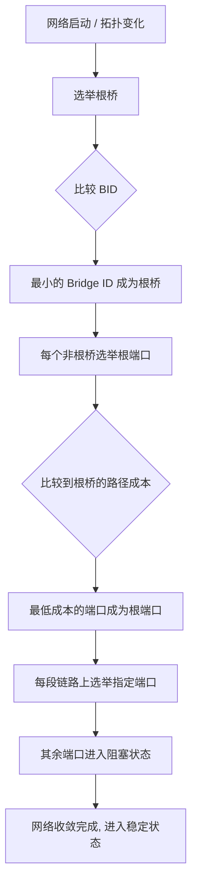

# STP / RSTP / MSTP 网络协议详解

> 生成树协议是防止二层网络环路的核心技术。从 STP → RSTP → MSTP 的演进过程，
> 体现了网络协议在收敛速度、资源利用方面的持续优化。
> 更新日期：2026年5月

---

## 零、为什么需要生成树协议？

### 环路带来的三大问题

```
网络拓扑（冗余链路导致环路）:

   ┌─────────┐
   │  SW-A   │
   └───┬──┬──┘
       │  │
   链路1│  │链路2（冗余链路，形成环路）
       │  │
   ┌───┴──┴──┐
   │  SW-B   │
   └─────────┘
```

| 问题 | 描述 | 后果 |
|------|------|------|
| **广播风暴** | 广播帧在环路中无限循环转发 | CPU 100%，网络瘫痪 |
| **MAC 表震荡** | 同一 MAC 地址在多个端口反复出现 | 交换机无法正确转发 |
| **多帧副本** | 同一帧被多次转发到目的主机 | 上层协议混乱 |

```
广播风暴示意:

   主机A 发送广播帧
        │
        ▼
   ┌─────────┐     端口1收到       ┌─────────┐
   │  SW-1   │ ─────────────────>  │  SW-2   │
   │         │ <─────────────────  │         │
   └─────────┘     端口2转发       └─────────┘
        │                                │
        └──────── 无限循环转发 ───────────┘
```

---

## 一、STP (802.1D) — 经典生成树协议

### 1.1 核心原理

```
STP 通过以下步骤将环形拓扑变为树形拓扑:

  1. 选举根桥 (Root Bridge)    -- 全网唯一的树根
  2. 选举根端口 (Root Port)    -- 每个非根桥上到达根桥最近的端口
  3. 选举指定端口 (Designated Port) -- 每条网段上到达根桥最近的端口
  4. 阻塞其余端口 (Blocked Port) -- 逻辑断开，防止环路
```

### 1.2 完整工作流程



### 1.3 BPDU (Bridge Protocol Data Unit) 详解

```
BPDU 报文结构（关键字段）:

  ┌──────────────────────────────────────────────────┐
  │  Protocol ID (2B)  │  Version (1B)  │ Type (1B) │
  ├──────────────────────────────────────────────────┤
  │  Flags (1B)                                         │
  ├──────────────────────────────────────────────────┤
  │  Root ID (8B) = 根桥的 Bridge ID                   │
  │    ├── Priority (2B): 0~61440, 步长 4096           │
  │    └── MAC Address (6B): 桥的 MAC 地址              │
  ├──────────────────────────────────────────────────┤
  │  Root Path Cost (4B): 到根桥的累计路径开销         │
  ├──────────────────────────────────────────────────┤
  │  Bridge ID (8B): 发送此 BPDU 的桥的 ID             │
  ├──────────────────────────────────────────────────┤
  │  Port ID (2B): 发送此 BPDU 的端口号                │
  └──────────────────────────────────────────────────┘

  选举比较顺序（四步比较法）:
  1. 最小 Root ID       (谁的根桥更优)
  2. 最小 Root Path Cost (谁离根桥更近)
  3. 最小 Bridge ID     (谁的桥 ID 更小)
  4. 最小 Port ID       (谁的端口 ID 更小)
```

### 1.4 端口状态机（STP 的慢速收敛根源）

```
STP 端口状态转换（5种状态，收敛需 30~50 秒）:

       端口启用
          │
          ▼
     ┌─────────┐
     │ Blocking │ ← 只能接收 BPDU，不转发数据 (20秒)
     │  阻塞    │
     └────┬────┘
          │ 收到更优 BPDU 后，等待 Max Age (20秒)
          ▼
     ┌─────────┐
     │Listening │ ← 监听 BPDU，不学习 MAC (15秒)
     │  监听    │
     └────┬────┘
          │ 等待 Forward Delay (15秒)
          ▼
     ┌─────────┐
     │Learning  │ ← 学习 MAC 地址，不转发数据 (15秒)
     │  学习    │
     └────┬────┘
          │ 等待 Forward Delay (15秒)
          ▼
     ┌─────────┐
     │Forwarding│ ← 正常转发数据
     │  转发    │
     └─────────┘

     ┌─────────┐
     │Disabled │ ← 管理员手动关闭
     │  禁用    │
     └─────────┘

  STP 收敛时间 = Blocking(20s) + Listening(15s) + Learning(15s) = 最长 50 秒！
```

### 1.5 STP 路径成本

| 链路速度 | STP 成本 (802.1D-1998) | STP 成本 (802.1D-2004) |
|---------|----------------------|----------------------|
| 10 Mbps | 100 | 2,000,000 |
| 100 Mbps | 19 | 200,000 |
| 1 Gbps | 4 | 20,000 |
| 10 Gbps | 2 | 2,000 |
| 100 Gbps | - | 200 |

### 1.6 STP 完整选举示例

```
拓扑图:

           SW-A (MAC: aa-aa-aa)    优先级: 32768
          /   \
         /     \
        /       \
   SW-B         SW-C
 (bb-bb-bb)   (cc-cc-cc)
   优先级:4096   优先级:32768
       |            |
       |            |
       └─────┬──────┘
             │
           SW-D (dd-dd-dd)  优先级:32768

  假设所有链路成本相同 = 4


  第1步: 选举根桥
  比较所有桥的 BID (Priority + MAC):
    SW-A: 32768:aa-aa-aa
    SW-B: 4096:bb-bb-bb   ← 优先级最小! → SW-B 是根桥
    SW-C: 32768:cc-cc-cc
    SW-D: 32768:dd-dd-dd


  第2步: 每个非根桥选举根端口（到根桥最近）
    SW-A:
      - 经直连链路到 SW-B: cost=4 -> 根端口
    SW-C:
      - 直连到 SW-B: cost=4 -> 根端口
    SW-D:
      - 经 SW-B: cost=4      } 开销相同，比较发送者
      - 经 SW-C: cost=4+4=8  } → 选直连 SW-B 为根端口


  第3步: 每条网段选举指定端口
    SW-A <-> SW-B:  SW-B 是根桥，端口为指定端口
    SW-B <-> SW-C:  SW-B 是指定端口
    SW-B <-> SW-D:  SW-B 是指定端口
    SW-A <-> SW-C:  比较... SW-A 到根 cost=4, SW-C 到根 cost=4
                    → SW-A BID 更小 → SW-A 端口为指定端口
    SW-C <-> SW-D:  比较后选择 → 阻塞 SW-D 的端口


  最终树形拓扑:
             SW-B (根桥) 
            /   |   \
           /    |    \
        SW-A  SW-C  SW-D
          |           
          |           
        (SW-C上的端口阻塞，逻辑断链)
```

### 1.7 STP 的缺点

| 问题 | 影响 |
|------|------|
| 收敛太慢(30-50秒) | 网络中断时间长，不可接受 |
| 不分 VLAN | 所有 VLAN 共用一个生成树，链路利用率低 |
| 被动等待超时 | 依赖计时器而非主动探测 |

---

## 二、RSTP (802.1w) — 快速生成树协议

### 2.1 核心改进

```
RSTP 之于 STP 的三大改进:

  1. 端口角色细化 ─── 增加 Alternate(备份根端口) 和 Backup 端口
  2. 快速收敛机制 ─── 提案/同意(Proposal/Agreement) 握手，秒级收敛
  3. 边缘端口 ─────── 连接主机的端口直接进入转发状态
```

### 2.2 端口角色对比

```
RSTP 端口角色（STP 只有 3 种，RSTP 有 5 种）:

  STP:                      RSTP:
  ┌──────────┐              ┌──────────────┐
  │ Root Port│──────────>   │ Root Port    │ 到根桥最近
  └──────────┘              ├──────────────┤
  ┌───────────────┐         │ Designated   │ 网段最优
  │Designated Port│──────>  │ Port         │
  └───────────────┘         ├──────────────┤
  ┌──────────────┐          │ Alternate    │ 其他桥的备份根端口
  │ Blocked Port │──┬───>   │ Port         │ (Discarding)
  └──────────────┘  │       ├──────────────┤
                    │       │ Backup Port  │ 同一桥的备份指定端口
                    └───>   │              │ (Discarding)
                            ├──────────────┤
                            │ Edge Port    │ 连接终端，直接转发
                            └──────────────┘
```

### 2.3 端口状态（从5种简化为3种）

```
  STP (5种状态):              RSTP (3种状态):

  ┌──────────┐                ┌─────────────┐
  │ Blocking │ ─┐             │             │
  ├──────────┤  │             │ Discarding  │  不转发、不学习 MAC
  │Listening │  ├──────>      │   (丢弃)    │
  ├──────────┤  │             ├─────────────┤
  │Learning  │ ─┘             │  Learning   │  学习 MAC，不转发
  ├──────────┤                ├─────────────┤
  │Forwarding│ ──────>        │ Forwarding  │  正常转发
  └──────────┘                └─────────────┘
  ┌──────────┐
  │ Disabled │ ──────>        端口 Down 状态
  └──────────┘
```

### 2.4 提案/同意机制（P/A 握手）

```
RSTP 快速收敛的核心 —— P/A 握手（秒级收敛):

  根桥(SW-A)               非根桥(SW-B)
      │                        │
      │── Proposal(提案) ────>│ "我想成为指定端口"
      │                        │
      │                    SW-B 收到提案后:
      │                    1. 同步(Sync): 阻塞所有非边缘指定端口
      │                    2. 选举自己的根端口
      │                        │
      │<── Agreement(同意) ───│ "我已准备好"
      │                        │
      │── 端口立即转发 ───────>│  不需要等计时器！

  对比 STP: STP 需要等 30-50 秒
           RSTP: 通常 < 1 秒完成收敛
```

### 2.5 RSTP 快速收敛场景

```
场景1: 链路故障（根端口 Down）

        SW-A (根)               SW-A (根)
        /    \                  /    \
       /      \     链路断     /      \
     SW-B    SW-C    ===>   SW-B    SW-C
    (RP)                (AP转为RP, 立即转发!)

  SW-B 的 Alternate Port 立即切换为 Root Port
  不需要等待任何计时器！


场景2: 边缘端口

  ┌──────┐     连接到主机
  │  SW  ├──── PC
  └──────┘
     边缘端口 ──── 配置为 PortFast，UP 后直接进入 Forwarding
     不会引起拓扑变化通知(TCN)
```

### 2.6 STP vs RSTP 对比

| 特性 | STP (802.1D) | RSTP (802.1w) |
|------|-------------|---------------|
| 端口状态 | 5 种 | 3 种 |
| 端口角色 | 3 种 | 5 种 |
| 收敛时间 | 30~50 秒 | 通常 < 1 秒 |
| BPDU 发送 | 仅根桥发起 | 每个桥都周期性发送 |
| 链路故障检测 | 等待 Max Age(20s) | 3 个 Hello Time(6s) 未收到就认为故障 |
| 边缘端口 | 不支持 | 支持 PortFast |
| 拓扑变化通知 | 需经根桥转发 | 直接泛洪 |
| 向下兼容 STP | - | 是 |

---

## 三、MSTP (802.1s) — 多生成树协议

### 3.1 为什么需要 MSTP？

```
STP/RSTP 的根本问题: 所有 VLAN 共用一个生成树

  ┌─────────────────────────────────┐
  │         Trunk 链路              │
  │   ┌─────────────────────────┐   │
  │   │ VLAN 10 (阻塞!)         │   │ ← 被 STP 阻塞，带宽浪费！
  │   │ VLAN 20 (阻塞!)         │   │
  │   │ VLAN 30 (阻塞!)         │   │
  │   └─────────────────────────┘   │
  └─────────────────────────────────┘

  STP/RSTP: 1 个生成树 -> 阻塞端口上所有 VLAN 都不能用
  MSTP:   N 个生成树实例 -> 不同 VLAN 可以走不同路径，负载均衡！
```

### 3.2 MSTP 核心概念

```
MSTP = RSTP + VLAN-实例映射

  ┌──────────────────────────────────────────┐
  │              MST 域 (Region)              │
  │                                          │
  │  实例 1 (MSTI 1):  VLAN 10, 20, 30     │
  │     生成树拓扑: SW-A -> SW-C -> SW-B     │
  │                                          │
  │  实例 2 (MSTI 2):  VLAN 40, 50, 60     │
  │     生成树拓扑: SW-A -> SW-B -> SW-C     │
  │                                          │
  │  IST (MSTI 0):  内部生成树，承载 MSTP 控制│
  │  CST:           域间生成树                │
  │  CIST:  IST + CST = 全局统一生成树       │
  └──────────────────────────────────────────┘
```

### 3.3 MSTP 拓扑示意

```
  实例 1 (VLAN 10,20):                  实例 2 (VLAN 30,40):

      SW-A (根 for MSTI 1)                 SW-A
      /         \                         /         \
   SW-B───────SW-C                     SW-B───────SW-C
   (阻塞)                             (阻塞 for MSTI 2)

  流量路径: SW-A -> SW-C             流量路径: SW-A -> SW-B -> SW-C
  VLAN 10,20 经 SW-C 转发            VLAN 30,40 经 SW-B 转发

  同一条物理链路，不同 VLAN 走不同路径 → 负载均衡！
```

### 3.4 MSTP BPDU 结构

```
MSTP BPDU 中包含 MSTI 配置信息:

  ┌─────────────────────────────────────────┐
  │  标准 RSTP BPDU (MSTI 0 / CIST)         │
  ├─────────────────────────────────────────┤
  │  MST 扩展字段:                           │
  │  ├── MST Config ID:                     │
  │  │   ├── Format Selector               │
  │  │   ├── Configuration Name (域名)      │
  │  │   ├── Revision Level (修订级别)      │
  │  │   └── Configuration Digest (配置摘要)│
  │  └── MSTI 记录 (每个实例):              │
  │      ├── MSTI ID                       │
  │      ├── Regional Root ID              │
  │      └── Internal Root Path Cost       │
  └─────────────────────────────────────────┘
```

### 3.5 MSTP 实例与 VLAN 映射

```
配置示例（Cisco 风格命令行）:

  ! 进入 MST 配置模式
  spanning-tree mode mst

  ! 配置 MST 实例到 VLAN 的映射
  spanning-tree mst configuration
   name REGION1
   revision 1
   instance 1 vlan 10, 20, 30
   instance 2 vlan 40, 50, 60

  ! 设置实例的根桥优先级
  spanning-tree mst 1 root primary
  spanning-tree mst 2 root secondary


  效果:
  ┌──────────┬─────────────────┬──────────────┐
  │  MST 实例 │  包含的 VLAN     │  转发路径     │
  ├──────────┼─────────────────┼──────────────┤
  │  MSTI 0  │  所有 VLAN(控制) │  通用生成树   │
  │  MSTI 1  │  VLAN 10,20,30  │  路径 A      │
  │  MSTI 2  │  VLAN 40,50,60  │  路径 B      │
  └──────────┴─────────────────┴──────────────┘
```

---

## 四、三者全面对比

### 4.1 核心差异总表

| 特性 | STP (802.1D) | RSTP (802.1w) | MSTP (802.1s) |
|------|-------------|---------------|---------------|
| **标准年份** | 1990 | 2001 | 2002 |
| **收敛时间** | 30-50 秒 | < 1 秒 | < 1 秒 |
| **端口状态数** | 5 | 3 | 3 |
| **端口角色数** | 3 | 5 | 5 |
| **生成树数量** | 1 (CST) | 1 (CST) | N (1+多实例) |
| **VLAN 感知** | 否 | 否 | 是 |
| **负载均衡** | 不支持 | 不支持 | 支持 |
| **BPDU 格式** | STP | RSTP (v2) | RSTP + MST 扩展 |
| **边缘端口** | 无 | PortFast | PortFast |
| **CPU 开销** | 低 | 低 | 中(多实例) |
| **向下兼容** | - | STP | STP / RSTP |
| **适用场景** | 老旧设备 | 中小型网络 | 大中型多 VLAN 网络 |

### 4.2 演进路线图

```
  STP(802.1D) ──────> RSTP(802.1w) ──────> MSTP(802.1s)
   1990                   2001                   2002
     │                      │                      │
     ▼                      ▼                      ▼
  解决环路问题           解决收敛速度            解决资源利用
  但太慢(30-50s)         但只有一个树             多实例+负载均衡
```

### 4.3 协议选择决策

```
选择什么协议?

  是否有老旧设备只支持 STP? ──是──> 用 STP (兼容模式)
       │
       否
       │
  需要多 VLAN 负载均衡? ──是──> 用 MSTP
       │
       否
       │
  对收敛速度有要求? ──是──> 用 RSTP
       │
       否
       │
    用 RSTP (现代交换机默认)
```

---

## 五、常见配置命令

### Cisco IOS

```cisco
! 查看生成树信息
show spanning-tree
show spanning-tree vlan 10
show spanning-tree summary

! STP 配置
spanning-tree mode pvst           ! Cisco 私有 PVST
spanning-tree vlan 10 priority 4096
spanning-tree vlan 10 root primary

! RSTP 配置
spanning-tree mode rapid-pvst

! MSTP 配置
spanning-tree mode mst
spanning-tree mst configuration
 name REGION1
 revision 1
 instance 1 vlan 10,20,30
 instance 2 vlan 40,50,60

! 边缘端口（连接 PC）
interface GigabitEthernet0/1
 spanning-tree portfast
 spanning-tree bpduguard enable
```

### 华为 / H3C

```
! 查看生成树
display stp
display stp brief

! STP 配置
stp mode stp
stp priority 4096

! RSTP 配置
stp mode rstp

! MSTP 配置
stp mode mstp
stp region-configuration
 region-name REGION1
 revision-level 1
 instance 1 vlan 10 20 30
 instance 2 vlan 40 50 60
 active region-configuration

! 边缘端口
interface GigabitEthernet0/0/1
 stp edged-port enable
```

---

## 六、面试常见问题

### Q1: STP 为什么要等 30~50 秒？

```
  Blocking(20s, Max Age) + Listening(15s, Forward Delay)
  + Learning(15s, Forward Delay) = 50 秒
  RSTP 用 P/A 握手替代了计时器等待
```

### Q2: 如何通过调整优先级控制根桥选举？

```
  优先级越低越优先，步长 4096
  推荐配置核心交换机为根桥:
    spanning-tree vlan 1 root primary   (优先级自动设 24576)
    spanning-tree vlan 1 root secondary (优先级自动设 28672)
```

### Q3: BPDU Guard / BPDU Filter / Root Guard 的区别？

| 特性 | 作用 |
|------|------|
| **BPDU Guard** | 边缘端口收到 BPDU 立即 shutdown，防止非法交换机接入 |
| **BPDU Filter** | 边缘端口不发送/接收 BPDU，完全忽略生成树 |
| **Root Guard** | 阻止端口成为根端口，防止根桥被篡位 |
| **Loop Guard** | 单向链路故障时阻止端口错误地进入转发状态 |

### Q4: MSTP 的实例与 VLAN 的映射关系？

```
  一个 VLAN 只能属于一个实例
  一个实例可以包含多个 VLAN
  同一个 MST 域内，域名+修订级别+实例映射必须一致
  域间通过 CST 互通（整个域像一个虚拟网桥）
```

---

## 七、总结

```
                     STP 三代演进核心思路

    STP               RSTP               MSTP
    ───               ────               ────
    解决: 环路        解决: 速度         解决: 效率
    手段: 阻塞端口    手段: P/A握手      手段: 多实例
    代价: 太慢        提升: 秒级收敛     提升: 负载均衡+快速

    学习建议: STP(理解原理) -> RSTP(理解改进) -> MSTP(理解应用)
```
